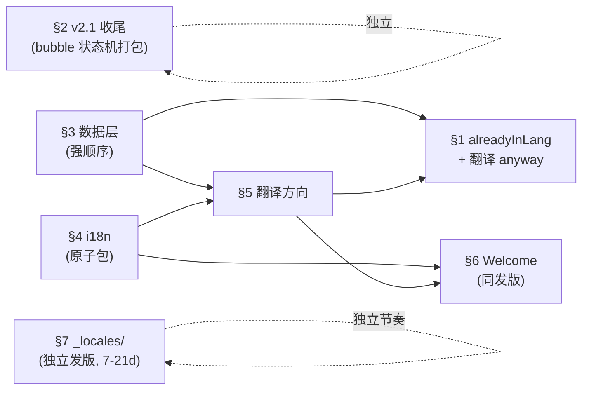

# DualRead 功能现状

> 最后更新：2026-05-02（按"能力域 + 状态"重排，依赖关系显式化）。
> 此文档反映"现在仓库里实际跑得起来的功能"，不依赖 commit 历史。

---

## 阅读说明

- **分类轴**：按"用户可感知的能力"分域，而非按版本号或时间线。
- **状态符号**：
  - ✅ 已实装（main 源码可见）
  - ⏳ 待实装
  - ⚠️ 风险 / 注意事项
- **依赖标注**：每个域末尾写明"被谁阻塞"和"会阻塞谁"。同域内若有"必须打包交付"的条目会单独说明。
- 文末有一张总依赖图（§9），快速决定下一刀切哪儿。

---

## 1. 翻译能力（Translate）

### ✅ 已实装

- **划词翻译气泡** — 任意网页选词 / 拖选短语，弹气泡显示译文（`src/content/bubble.ts` + `src/content/index.ts`，shadow DOM + loading / translated / error 三态）。
- **后台翻译代理** — Service Worker 调 Google Translate（`src/background/translate.ts`），带 `chrome.storage.session` 缓存。

### ⏳ 待实装

- **同语对识别状态（alreadyInLang）** — 当源语言 = 目标语言（如译者已经把页面切到中文）时，气泡显示提示而不是再翻一遍。需在 `BubbleState` union 加 `alreadyInLang` 变体 + `.dr-bubble__already` 样式。
- **同语对"翻译 anyway"按钮** — 古文 / 文白对译场景，让用户在已识别为同语对时强制翻译。

### 依赖

- 被阻塞：两条都依赖 §3（数据层）落地后才能稳定上线，因为 alreadyInLang 需要 `source_lang` / `target_lang` 字段才能正确判定方向。

---

## 2. 生词与高亮（Vocab & Highlight）

### ✅ 已实装

- **生词本** — 保存生词，按时间 / 字母排序、搜索（`src/sidepanel/screens/Vocab.tsx` + `src/sidepanel/useVocab.ts`）。
- **CSV 导出** — 导出全部生词为 CSV，可导入 Anki（`src/sidepanel/exportCsv.ts`，header：`word, translation, context, source_url, created_at, source_lang, target_lang`，RFC 4180 转义）。
- **自动高亮** — 已保存词在所有网页自动加下划线 / 背景色（`src/content/highlight.ts`，正则匹配 + DOM 包裹 + MutationObserver）。
- **悬停高亮变色** — `src/content/content.css` 里 `.dr-hl:hover` 柔色背景。
- **右下浮动 FAB** — 一键开关学习模式（`src/content/fab.ts`，44×44 按钮，`role="switch"`；off = 全部静默）。
- **学习模式总开关** — `learning_mode_enabled`（`src/shared/types.ts`）；关掉后 content script 全静默，FAB 仍可重新开。
- **侧栏 3 个 tab** — Translate / Vocab / Settings（`src/sidepanel/App.tsx`）。
- **同步状态指示** — `chrome.storage.sync` 状态徽标（`src/sidepanel/useSyncStatus.ts` + Settings 屏 `<SyncIndicator>`）。

### ⏳ 待实装

（暂无；hover/click 已统一为同一气泡，删除 + 撤销 toast 已落地。）

### 依赖

- 不依赖其他域。可独立交付。

---

## 3. 数据层（Data Schema & Migration）

### ✅ 已实装

- **`VocabWord` schema** — 当前字段：`word` / `word_key` / `translation` / `source_lang?` / `target_lang?` / `ctx?` / `source_url?` / `created_at` / `updated_at` / `schema_version`（`src/shared/types.ts`）。
- **存储分层**：`sync` 存生词 per-key `v:<word_key>`、`local` 存 settings / write buffer / 元数据、`session` 存翻译缓存。

### ⏳ 待实装（强顺序）

> 顺序不可换。前一项是后一项的前置门。单次发版完成；不做"先发松校验版"的过渡发版（详见 ARCHITECTURE.md D22）。

1. **扩 `VocabWord` 字段** — 加 `source_lang` / `target_lang` / `translation`（替代旧 `zh` / `en` 的方向语义）；migration 当次删除 `zh` / `en`，`translation` 为唯一权威字段。
2. **双轨 migration 触发 + `migrationReady` 排序契约** — `onInstalled("update")` 与 SW 冷起 `init()` 共用同一个 `runMigrationIfNeeded()`；`chrome.runtime.onMessage.addListener` 顶层注册，写路径 handler 第一行 `await migrationReady`（详见 ARCHITECTURE.md D7 / D21）。
3. **4 个 P0 安全护栏**：
   - schema version flag — `local["schema_version"]` + 类型字面量 `CURRENT_SCHEMA_VERSION`
   - 单条 8 KB cap（双层）— `useVocab.save` / 气泡 ingress + `vocab.ts` flush 前预检；`ctx` 优先截断，截后仍超长才硬拒
   - SW `onSuspend` flush（best-effort，~5 s 预算，不保证执行；冷起 `init()` 才是真正兜底）
   - empty-`zh` skip — 老数据中 `zh` 为空时跳过 migration，不臆造默认值
4. **migration vitest 覆盖** — 当前测试只有 `wordBoundary.test.ts` 和 `highlightable.test.ts`，无 migration 用例。最小测试矩阵见 ARCHITECTURE.md §14。
5. **CSV 导出新列** — header 加 `source_lang` / `target_lang`，与新 schema 对齐。

### 依赖

- 阻塞 §1（alreadyInLang）。
- 自身不被任何域阻塞，可立即开工。

---

## 4. 国际化（i18n）

### ✅ 已实装

- **侧栏 UI 双语** — `src/sidepanel/i18n.ts` 提供 `zh-CN` / `en` 两套字符串。
- **气泡 / FAB 双语** — `src/content/index.ts` 内硬编码 zh-CN/en 文案（待去硬编码，见下方）。

### ⏳ 待实装（原子包，全做或全不做）

> `Lang` union 扩张 = 类型守卫 + 所有 UI 字符串扩张，必须同次落地，否则 storage 读出 `"ja"` / `"fr"` 会绕过类型系统。

- **`Lang` union 扩成 4 语 + `isValidLang` 类型守卫** — `src/shared/types.ts` 当前还是 `"zh-CN" | "en"`。union 扩张和守卫是同一改动的两面。
- **侧栏 ~70 个 UI 字符串补 `ja` / `fr`**。
- **气泡 / Toast / FAB 字符串去硬编码并补 4 语** — 走 i18n 表，不再写死。
- **Settings 4 语下拉框** — 当前只有 zh-CN / en 两个 LangBtn。
- **首次安装自动检测语言** — `src/background/index.ts` `onInstalled` 当前没读 `navigator.language`。
- **Noto Sans JP 自托管 `@font-face`** — `src/sidepanel/styles.css` 当前没有；不自托管会被 CWS 拒。
- **Settings `onChange` 写 storage 去重** — 当前会重复写。

### 依赖

- 被阻塞：无。
- 阻塞 §6（Welcome 母语 grid）。

---

## 5. 翻译方向（Direction Settings）

### ✅ 已实装

- **目标语言跟 UI 语言**（`ARCHITECTURE.md` D24）— 翻译目标始终等于 `Settings.ui_language`，无独立字段。
- **源语言交给 Google 自动检测** — `TRANSLATE_REQUEST` 默认 `source: "auto"`；不再需要源语言下拉。
- **bubble 显示 alreadyInLang 状态** — 检测到的源语言 = 目标语言时弹 alreadyInLang 提示 + "翻译 anyway"。

### 依赖

- 无。本域已落地，无后续待办。

---

## 6. 首次运行（Onboarding）

### ⚠️ 必须同发版（跨域）

Welcome 屏改造横跨 §4 和 §5 的需求：

- **拿掉 CEFR level 选择** — 当前 Welcome 屏是 A2/B1/B2/C1 grid，与 v2.3 之后的产品定位不符。
- **加 4 语母语选择 grid** — 让首装用户挑界面语言。

两条改的是同一块 UI。**只做任一项都会出现过渡态**（要么"既有 CEFR 又有语言选择"，要么"两块都没了，Welcome 几乎为空"）。建议在同一个发版里同时落。

### 依赖

- 母语 grid 部分依赖 §4 的 `Lang` 扩张完成；CEFR 移除部分依赖 §5 的方向逻辑落地（否则失去默认方向来源）。

---

## 7. 商店与隐私（Store & Privacy）

### ✅ 已实装

- **隐私政策页** — 仓库根目录 `privacy-policy.html`（CWS 审核需要）。

### ⏳ 待实装（独立发版节奏）

- **商店元数据 4 语化** — 新建 `_locales/ja/` + `_locales/fr/`。

### ⚠️ 部署风险

- 修改 `_locales/` 会触发 CWS **full re-review，预计 7–21 天**。
- 不要与 §4 i18n 同包发版；建议在 §4 发版稳定后单独再走一次商店发布，避免功能更新被审核拖住。

---

## 8. 长期 backlog（不绑版本）

- **Per-domain FAB 隐藏** — 用户在某些站点想关 FAB。
- **Welcome 视口 < 600px 不许滚动** — manual smoke 检查项。

---

## 9. 依赖关系总图

可独立开工的入口（无前置）：**§2、§3、§4**。其余必须等前置。

---

## 10. 决策日志

| # | 决定 | 备选 | 理由 |
|---|---|---|---|
| D1 | 文档按"能力域 + 状态"分类，而非版本号 | 保留按版本分组 | 版本分组让"做 A 必须先做 B"的依赖埋在文字里看不出 |
| D2 | 悬停预览 + 删除按钮打包做 | 各做各的 | 两项共改 `bubble.ts` 状态机 |
| D3 | `Lang` union 扩张与 `isValidLang` 守卫合为同一项 | 保留单列 | 守卫是 union 扩张的一部分，不是独立任务 |
| D4 | "`zh` 字段 optional"提到 §3 最前 | 留在 P0 护栏打包里 | 它是 migration 前置门，不是事后补丁 |
| D5 | Welcome 改造跨域时显式要求"同发版" | 不标注 | 单做任一会产生过渡态 UI |
| D6 | `_locales/` 改动单列、标 7–21 天 re-review | 与 §4 i18n 同包 | 部署节奏不同，混在一起会误导 |
